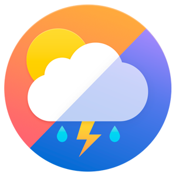
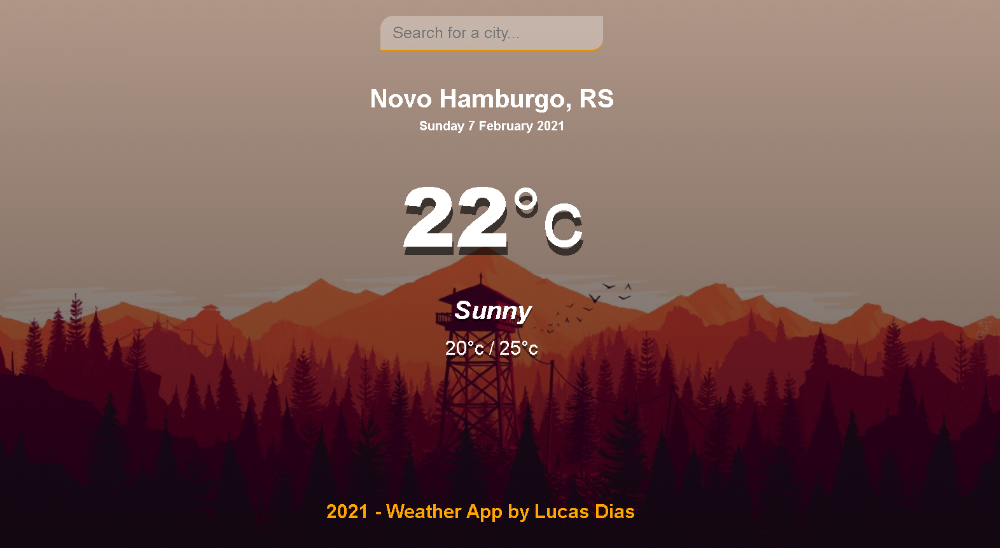

<h1 align="center">
    
</h1>

# Sumário

- [Descrição](#📝-Descrição)
- [Projeto](#💻-Projeto)
- [Tecnologias utilizadas](#🚀-Tecnologias-utilizadas)
- [Status do Projeto](#🎯-Status-do-Projeto)

---

## 📝 Descrição

>💻 O Aplicativo do tempo é um site que fornece informações relacionadas ao clima de sua respectiva região, o projeto foi criado com o objetivo de praticar habilidades de HTML e CSS.

---

## 💻 Projeto

* <b>Temperatura</b>: É possível monitorar a temperatura de determinada região adicionada na barra de pesquisa.

<h1 align="center">
    
</h1>

---

## 🚀 Tecnologias utilizadas
Esse projeto foi desenvolvido com as seguintes tecnologias:
* VS Code;
* HTML;
* CSS;

---

## 🎯 Status do Projeto

Este projeto atualmente está <b>em progresso </b>.

---

## Autor

- Projetos - [Lucass2021](https://github.com/Lucass2021)

- Linkedin - [@Lucas Dias da Silva](https://www.linkedin.com/in/lucas-dias-da-silva-118954199/)

- Email - [Lucas Dias](mailto:lucas.allx@hotmail.com")
